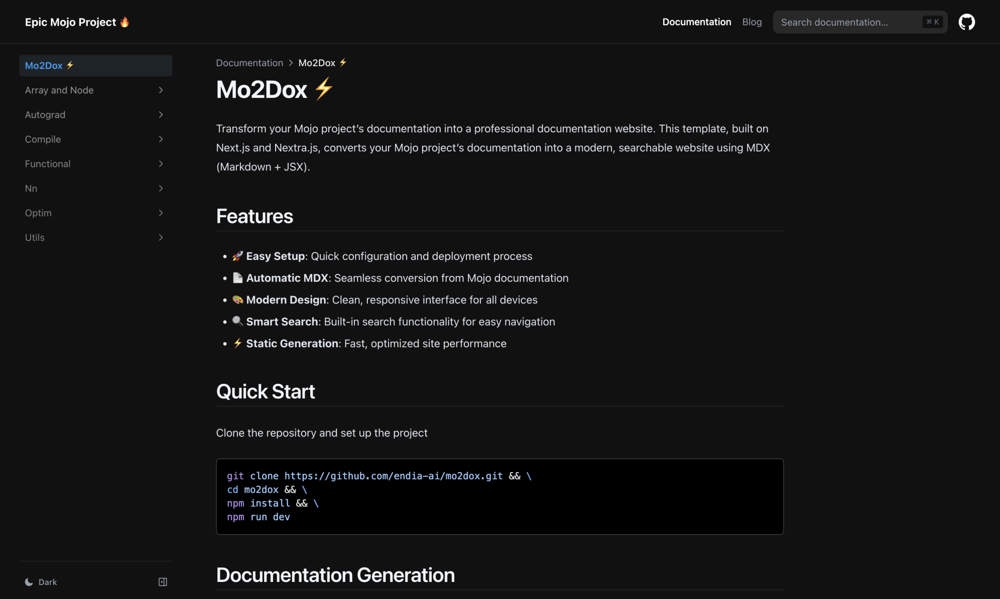
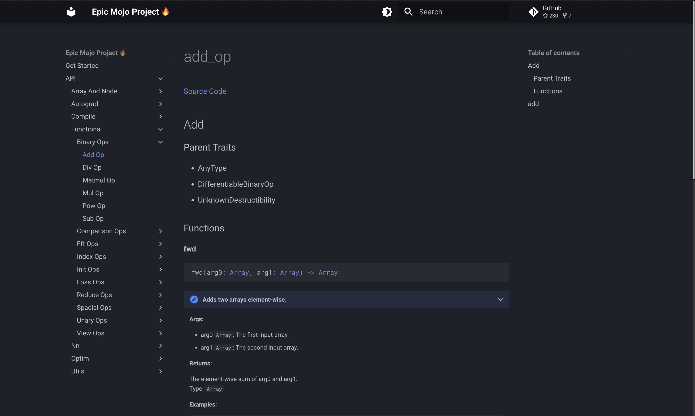

# Mo2Dox ⚡

Transform your Mojo project documentation into a professional website using either Material for MkDocs or Nextra documentation frameworks.

**Prerequisites:**  
- A Mojo project
- Documentation JSON generated using `mojo doc` command

## Get Started with either a Nextra or Material for MkDocs template

### Option 1 - Nextra
Nextra is a full-featured web documentation framework built with React and MDX (Markdown + JavaScript), offering advanced component integration and customization.

**Installation:**
```bash
git clone https://github.com/endia-ai/Mo2Dox.git
cd Mo2Dox/nextra
npm install
npm run dev
```

**Preview:**

<p align="center">
    
</p>


### Option 2 - Material for MkDocs

Material for MkDocs is a Python-based documentation framework focused on creating clean, markdown-driven documentation sites with minimal setup.

**Installation:**
```bash
git clone https://github.com/endia-ai/Mo2Dox.git
cd Mo2Dox/mkdocs
pip install mkdocs mkdocs-material
mkdocs serve
```

**Preview:**

<p align="center">
    
</p>

## Getting Started
Select the implementation that aligns with your technology stack and requirements. Both options deliver feature-rich documentation sites with professional capabilities including search, navigation, and responsive design.

License: MIT
